# **BRSM Project**

Краткое описание проекта, его цели и основные возможности

Ссылки на репозиторий сервера и клиента:

- [Репозиторий сервера](https://github.com/Karina2409/brsm-server)

- [Репозиторий клиента](https://github.com/Karina2409/brsm-frontend)

---

## **Содержание**

1. [Архитектура](#Архитектура)
    1. [C4-модель](#C4-модель)
    2. [Схема данных](#схема-данных)
2. [Функциональные возможности](#функциональные-возможности)
    1. [Диаграмма вариантов использования](#диаграмма-вариантов-использования)
    2. [User-flow диаграммы](#user-flow-диаграммы)
    3. [Примеры экранов UI](#примеры-экранов-ui)
3. [Детали реализации](#детали-реализации)
    1. [UML-диаграммы](#UML-диаграммы)
    2. [Спецификация API](#спецификация-api)
    3. [Безопасность](#Безопасность)
    4. [Оценка качества кода](#оценка-качества-кода)
4. [Тестирование](#Тестирование)
    1. [Unit-тесты](#Unit-тесты)
    2. [Интеграционные тесты](#интеграционные-тесты)
5. [Установка и запуск](#установка-и-запуск)
    1. [Развертывание](#развертывание)
    2. [Манифесты для сборки docker образов](#манифесты-для-сборки-docker-образов)
    3. [Манифесты для развертывания k8s кластера](#манифесты-для-развертывания-k8s-кластера)
6. [Лицензия](#Лицензия)
7. [Контакты](#Контакты)

---
## **Архитектура**

### C4-модель

#### Контейнерный уровень архитектуры ПС


Программа будет содержать одну клиентскую часть и 5 микросервисов:
1. StudentService предназначен для обработки бизнес-логики, связанной со студентами. 
2. EventService будет обрабатывать бизнес-логику, связанную с мероприятиями. 
3. DataService будет обрабатывать бизнес-логику, связанную с импортом и экспортом данных в системе. 
4. SecurityService будет содержать логику авторизации, а также будет обрабатывать логику, связанную с данными пользователей. 
5. DocumentService будет обрабатывать бизнес-логику, связанную с освобождениями, ходатайствами и докладными. 

Также будет создано три базы данных: EventStudentDB, UserDB, DocumentDB. 

Для взаимодействия клиента с сервером будет создан специальный шлюз API Gateway. Он будет проксировать запрос к нужному сервису, а также будет проверять токен и безопасность.

#### Компонентный уровень архитектуры ПС


Компонентный уровень программного средства представлен на примере микросервиса StudentService. API Gateway будет отправлять запросы на определенные сервисы, которые в свою очередь будут отлавливать их в контроллерах и далее через сервисы и репозитории запросы будут идти в БД.

#### Диаграмма классов и интерфейсов


Клиентская часть будет отправлять запрос на сервер, далее StudentController использует дто StudentDTO и EventDTO. Запрос из контроллера будет идти в интерфейс StudentService. Далее обрабатывать этот запрос будет StudentServiceImpl – это реализация интерфейса StudentService. Он будет выполнять различные расчеты, и отправлять запрос в репозиторий, который в свою очередь отправит запрос в БД.

### Схема данных

#### База данных documents


#### База данных core_academics


#### База данных users_auth


#### Диаграмма компонентов

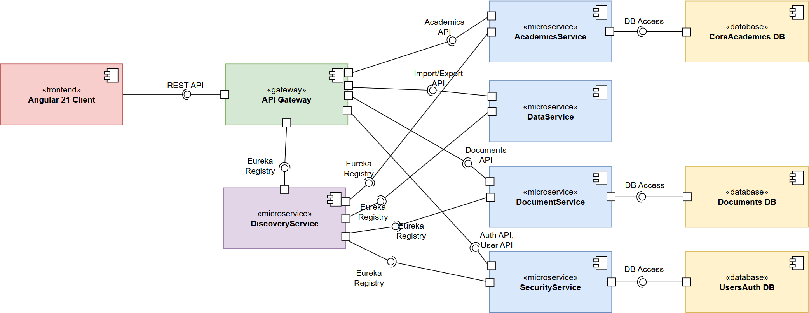

#### Диаграмма размещения

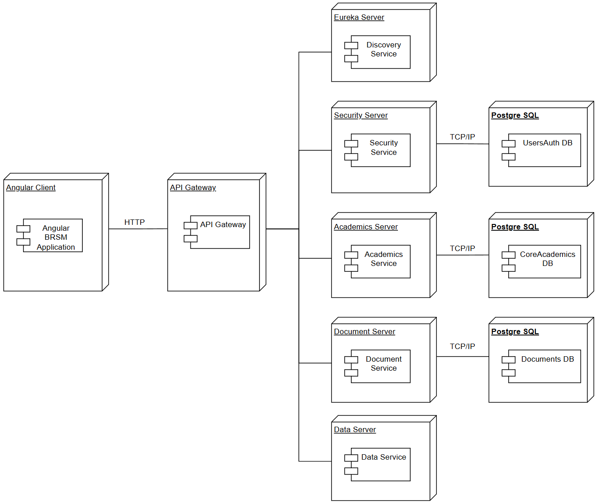

#### Диаграмма пакетов

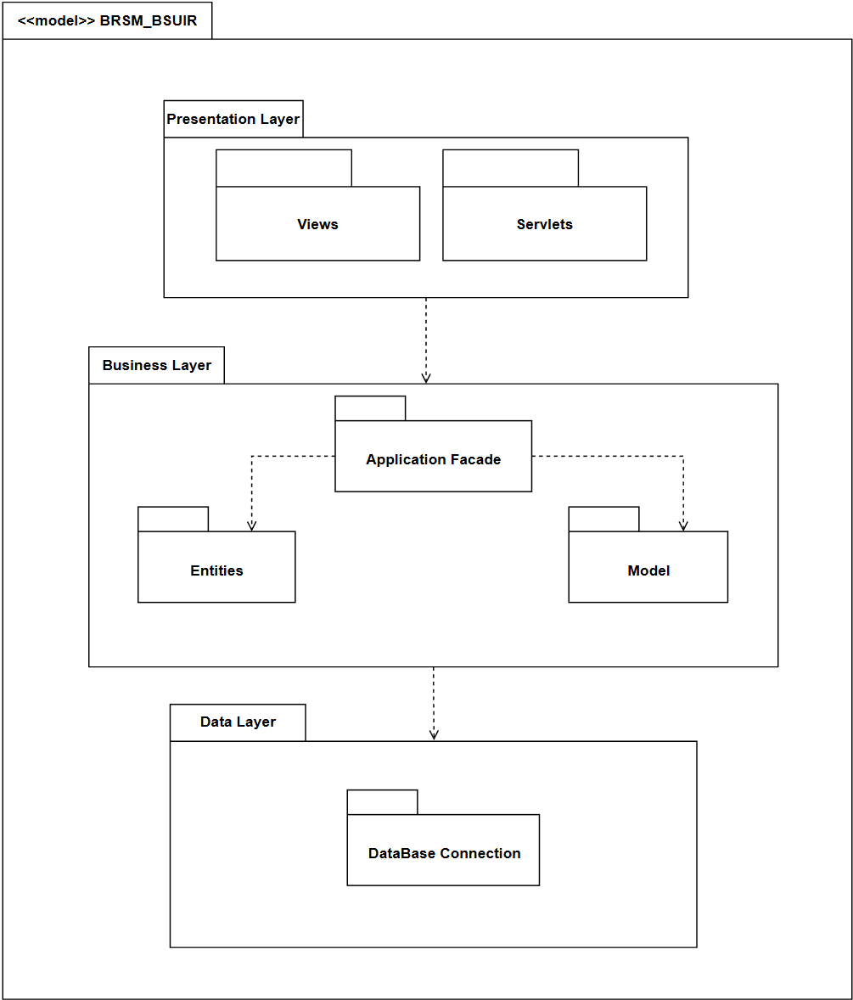

#### Диаграмма деятельности

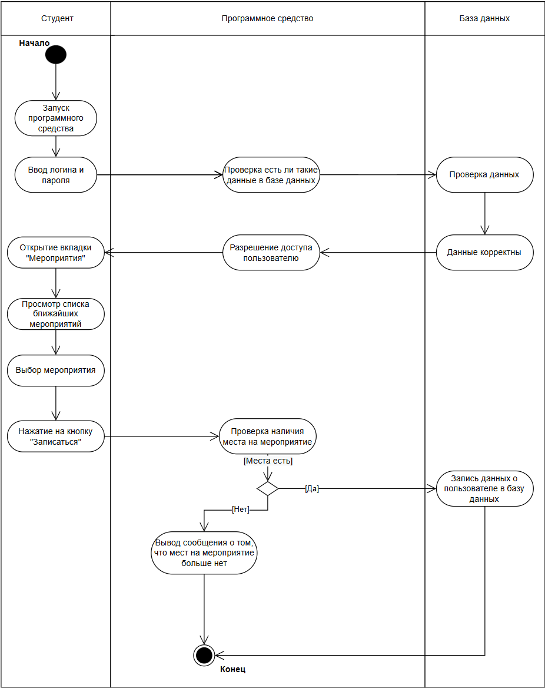

#### Диаграмма последовательности

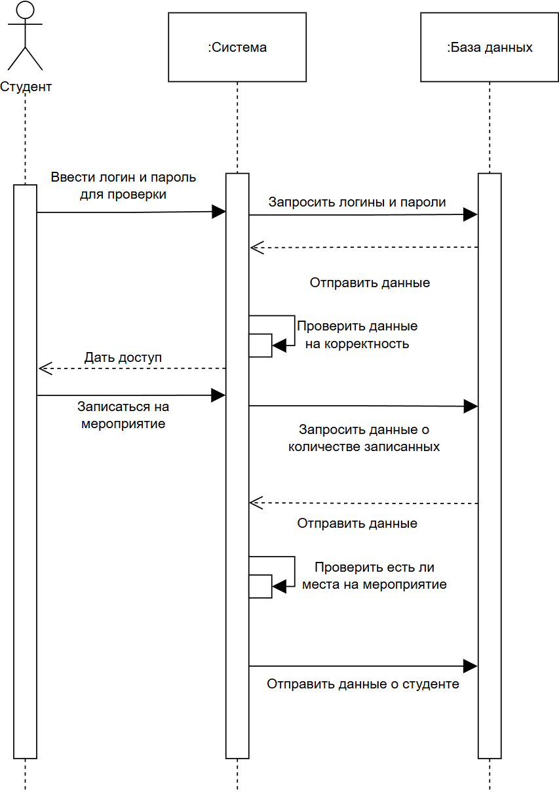

#### Диаграмма состояний

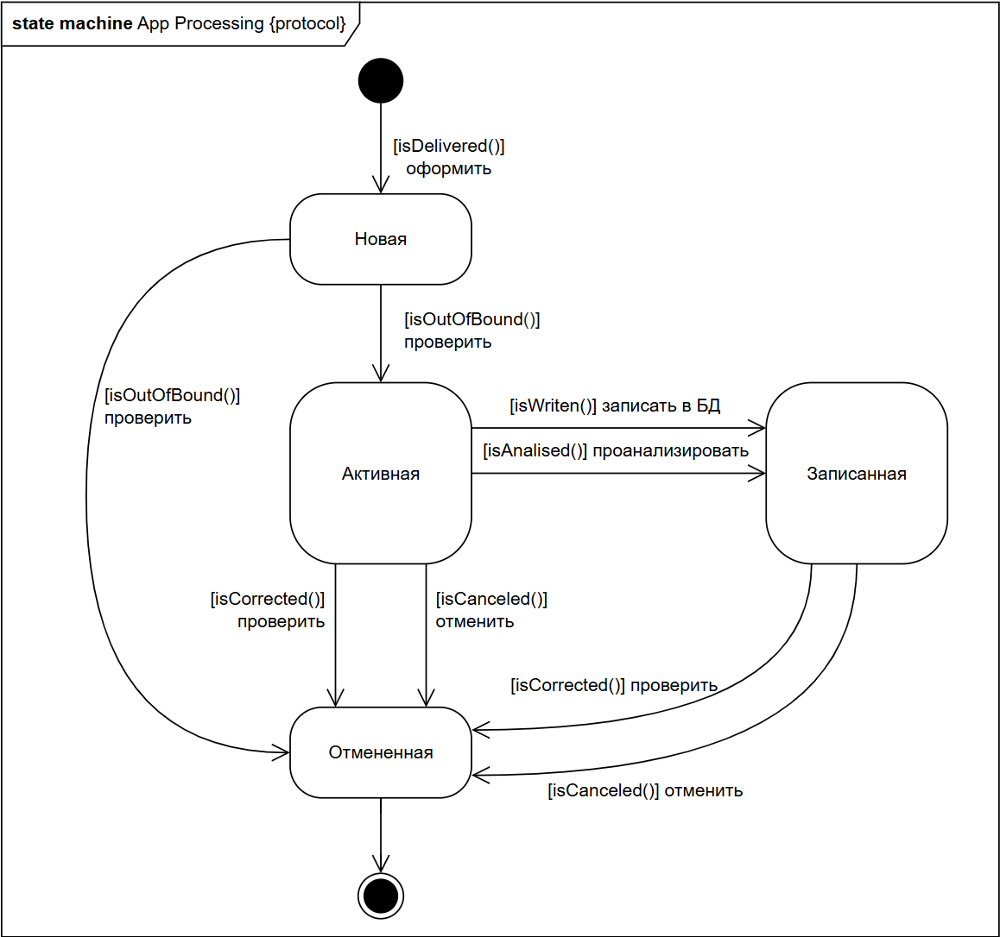

---

## **Функциональные возможности**

### Диаграмма вариантов использования

Диаграмма вариантов использования и ее описание

### User-flow диаграммы

User-flow диаграмма для пользователя Студент


User-flow диаграмма для пользователя Секретарь БРСМ


User-Flow диаграмма пользователя Секретарь факультета


User-Flow диаграмма страницы Студенты


User-Flow диаграмма страницы Мероприятия


User-Flow диаграмма страницы Документация


User-Flow диаграмма страницы Статистика


User-Flow диаграмма страницы Профиль


User-Flow диаграмма страницы Пользователи


### Примеры экранов UI

#### Авторизация


#### Страница Студенты


#### Страница Информация о студенте


#### Страница Мероприятия


#### Страница Информация о мероприятии


#### Страница Изменение мероприятия


#### Страница Создание мероприятия


#### Модальное окно выбора студентов для мероприятия


#### Страница Освобождения


#### Страница Статистика


#### Страница Главная


#### Страница Профиль


---

## **Детали реализации**

### UML-диаграммы

Представить все UML-диаграммы , которые позволят более точно понять структуру и детали реализации ПС

### Спецификация API

#### Документация к Academics Service

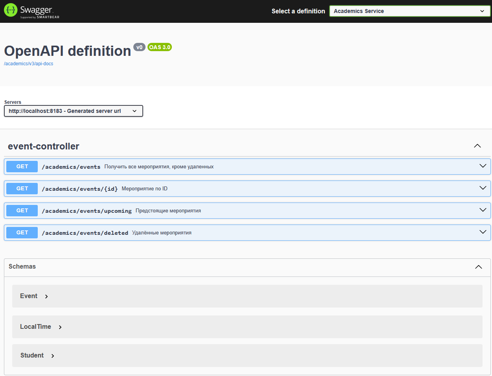

#### Документация к Security Service

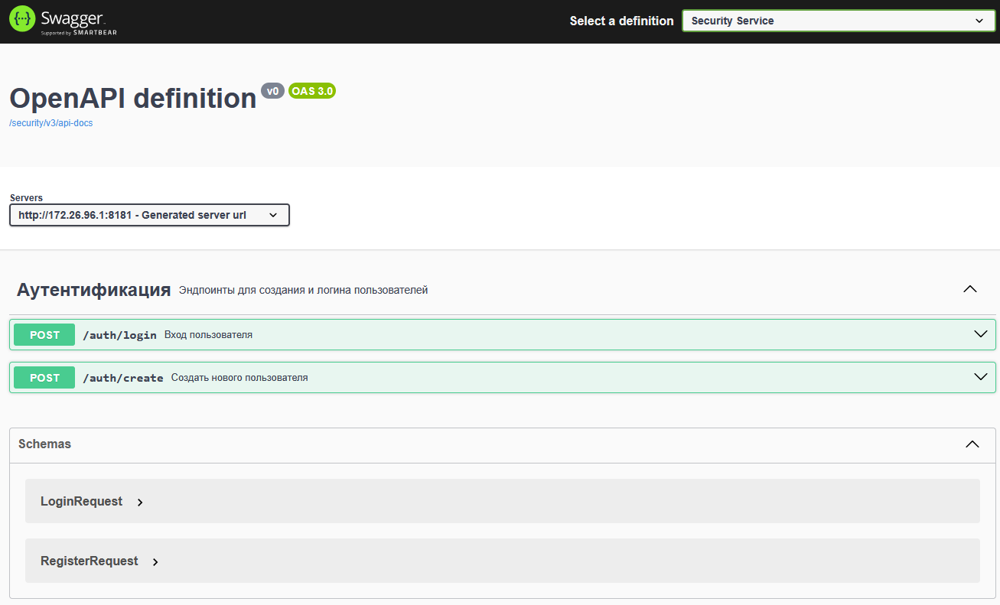

#### Файл с документацией для Postman

[collection-for-postman.json](assets/collection-for-postman.json)

### Безопасность

В рамках реализации серверной части программной системы был разработан модуль безопасности, обеспечивающий аутентификацию и авторизацию пользователей. Система разработана по микросервисной архитектуре и включает следующие сервисы:
1. API Gateway – единая точка входа в систему, выполняет проверку JWT-токена.
2. Security-service – сервис аутентификации пользователей, генерации JWT и управления учётными записями.
3. Eureka Discovery Service – сервис для регистрации и обнаружения микросервисов.

Для аутентификации и авторизации используются компоненты, перечисленные в таблице ниже.

Таблица 1.1 – Компоненты, используемые для аутентификации и авторизации

| Компонент                   |                     Назначение                     |
|-----------------------------|:--------------------------------------------------:|
| JJWT (Java JWT)             |         Создание, парсинг и валидация JWT          |
| Spring Security	            |  Используется для контроля доступа и безопасности  |
| Spring Cloud Gateway	       |     Центральная точка входа, проверка токенов      |
| Spring Cloud Netflix Eureka |       Сервис-регистрация и сервис-дискавери        |
| BCrypt PasswordEncoder      | Хеширование паролей (устойчиво к атакам перебора)  |

Для реализации безопасности использовались компоненты `Spring Security` и сторонняя библиотека `JSON Web Tokens (jjwt)`. Пароли хранятся в базе данных в виде хэш-значений, полученных с помощью алгоритма `BCrypt`. На рисунке представлен пример записи в таблице из БД с хэшированным паролем.

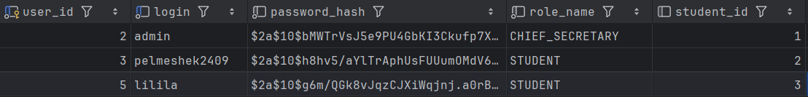

Аутентификация – это процесс проверки логина и пароля пользователя и выдачи токена доступа. За механизм аутентификации отвечает сервис `security-service`. Компоненты, реализованные в `security-service` представлены в таблице.

| Компонент      |                                 Описание                                 |
|----------------|:------------------------------------------------------------------------:|
| User           |              Сущность (entity) пользователя, хранимая в БД               |
| UserRepository |                Обеспечивает доступ к данным пользователей                |
| AuthController |           Содержит точки входа «/auth/login» и «/auth/create»            |
| AuthService    | Содержит логику проверки пароля, вызывает метод для генерации JWT токена |
| JwtService     |                 Отвечает за формирование и проверку JWT                  |

Ниже представлен код генерации токена.

```java
public String generateToken(String username, String role, Integer studentId) {
    return Jwts.builder()
            .setClaims(Map.of(
                    "role", role,
                    "studentId", studentId
            ))
            .setSubject(username)
            .setIssuedAt(new Date())
            .setExpiration(new Date(System.currentTimeMillis() + expiration))
            .signWith(getSigningKey(), SignatureAlgorithm.HS256)
            .compact();
}
```

Для генерации токена использовался секретный ключ, хранящийся в конфигурации, а также алгоритм подписи токена `HS256` (`HMAC` + `SHA-256`). У токена задано время жизни.
Ниже представлен метод из сервиса `AuthService` для авторизации пользователя.

```java
public String login(LoginRequest request) {
    User user = userRepository.findByLogin(request.getLogin())
            .orElseThrow(() -> new RuntimeException("User not found"));

    if (!passwordEncoder.matches(request.getPassword(), user.getPasswordHash())) {
        throw new RuntimeException("Invalid credentials");
    }

    return jwtService.generateToken(user.getLogin(), user.getRole().name(), user.getStudentId());
}
```

Для повышения безопасности, был реализован централизованный контроль доступа на стороне `Gateway`, что позволяет защитить микросервисы ещё до передачи запроса в backend-логику. Функции, реализованные в фильтре в `api-gateway`:
1 Проверка `JWT`-токена (фильтр проверяет подпись и сроки токена).

```java
private String extractToken(ServerWebExchange exchange) {
    String auth = exchange.getRequest().getHeaders().getFirst("Authorization");
    return (auth != null && auth.startsWith("Bearer ")) ? auth.substring(7) : null;
}

private Claims parseToken(String token) {
    return Jwts.parserBuilder()
       .setSigningKey(Keys.hmacShaKeyFor(Decoders.BASE64.decode(SECRET)))
       .build()
       .parseClaimsJws(token)
       .getBody();
}
```

2 Выделение данных пользователя (извлекает роли, логин).

```java
Claims claims = parseToken(token);
String role = claims.get("role", String.class);
```

3 Ролевая авторизация (контролирует доступ по маршрутам, указанным в коллекции `PATH_ROLES`, заданной в компоненте).

```java
private static final Map<String, Set<String>> PATH_ROLES = Map.of(
        "/auth/create", Set.of("CHIEF_SECRETARY")
);

private boolean hasAccess(String path, String role) {
    return PATH_ROLES.entrySet().stream()
            .filter(entry -> pathMatches(path, entry.getKey()))
            .anyMatch(entry -> entry.getValue().contains(role));
}

private boolean pathMatches(String path, String pattern) {
    if (pattern.endsWith("/**")) {
        String prefix = pattern.substring(0, pattern.length() - 3);
        return path.startsWith(prefix);
    }
    return path.equals(pattern) || path.startsWith(pattern + "/");
}
```

4 Генерация ошибок (возвращает 401 в случае, если токен не найден или он не корректный, 403 в случае, если доступ запрещен из-за некорректной роли).

```java
private Mono<Void> unauthorized(ServerWebExchange exchange, String msg) {
    exchange.getResponse().setStatusCode(HttpStatus.UNAUTHORIZED);
    exchange.getResponse().getHeaders().add("Content-Type", "application/json");
    return exchange.getResponse().writeWith(Mono.just(
            exchange.getResponse().bufferFactory().wrap(
                    ("{\"error\": \"" + msg + "\"}").getBytes()
            )
    ));
}

private Mono<Void> forbidden(ServerWebExchange exchange, String msg) {
    exchange.getResponse().setStatusCode(HttpStatus.FORBIDDEN);
    exchange.getResponse().getHeaders().add("Content-Type", "application/json");
    return exchange.getResponse().writeWith(Mono.just(
            exchange.getResponse().bufferFactory().wrap(
                    ("{\"error\": \"" + msg + "\"}").getBytes()
            )
    ));
}
```

Регистрация пользователя происходит секретарем, сам пользователь не может зарегистрироваться. Ниже представлен метод в контроллере для регистрации пользователя.

```java
@PostMapping("/create")
public ResponseEntity<?> createUser(@RequestBody RegisterRequest request) {
    return ResponseEntity.ok(authService.createUser(request));
}
```

Ниже представлен метод из сервиса `AuthService` для создания пользователя.

```java
public String createUser(RegisterRequest request) {
    User user = new User();
    user.setLogin(request.getLogin());
    user.setPasswordHash(passwordEncoder.encode(request.getPassword()));
    user.setRole(Role.STUDENT);
    user.setStudentId(request.getStudentId());

    userRepository.save(user);
    return "User registered successfully";
}
```

### Оценка качества кода

#### Оценка качества кода серверной части

Анализ кода на дублирование

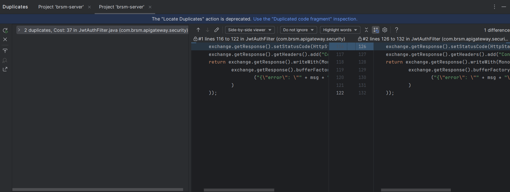

Отчет по другим метрикам в SonarQube

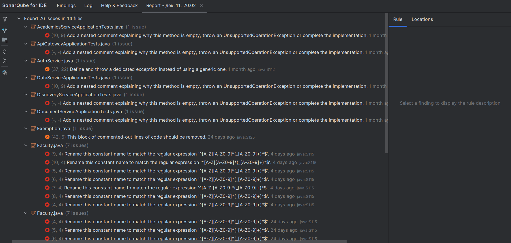

Итог анализа метрик серверной части

| Метрика        | Значение          | Комментарий                                                                                                                           |
|----------------|-------------------|---------------------------------------------------------------------------------------------------------------------------------------|
| Сложность кода | 0 проблемных мест | Место считается проблемным, если сложность кода превышает 15                                                                          |
| Дублирование   | 0 проблемных мест | В отчете SonarQube отсутствуют предупреждения, касающиеся длинных методов.                                                            |
| Длинные методы | 0 проблемных мест | Дублирование выявляется если количество одинаковых строк, идущих подряд больше 5. Одно дублирование было выявлено и сразу исправлено. |
| Запахи кода    | 0 проблемных мест | В отчете SonarQube отсутствуют предупреждения, касающиеся запахов кода.                                                               |

#### Оценка качества кода клиентской части

Расчет метрики Размер компонентов

| Компонент    | Количество строк html | Количество строк ts | Количество методов |
|--------------|-----------------------|---------------------|--------------------|
| StudentsPage | 150                   | 100                 | 10                 |
| Header       | 32                    | 15                  | 0                  |
| Search       | 8                     | 21                  | 1                  |
| ProfilePage  | 132                   | 129                 | 7                  |
| _Среднее_    | _80_                  | _74_                | _4,5_              |

Анализ кода с помощью `Eslint`

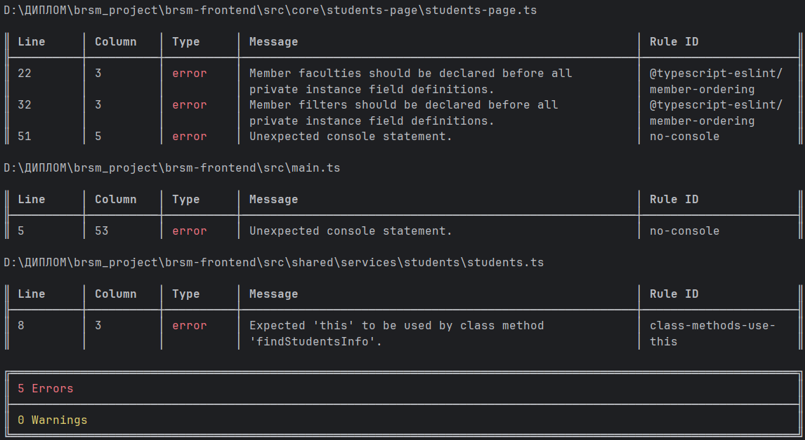

---

## **Тестирование**

### Unit-тесты

Были реализованы unit-тесты для сервисного и контроллерного слоёв микросервиса AcademicsService.

Тестирование выполнено с использованием JUnit 5, Mockito и Spring Boot Test.

| Название метода                           | Описание                                                             | Результат выполнения |
|-------------------------------------------|----------------------------------------------------------------------|----------------------|
| `findAllActiveEvents_returnsActiveEvents` | Получение списка активных (не удалённых) мероприятий                 | Успешно              |
| `findAllUpcoming_returnsUpcomingEvents`   | Получение предстоящих мероприятий                                    | Успешно              |
| `findByIdActive_returnsEventWhenExists`   | Поиск мероприятия по идентификатору                                  | Успешно              |
| `findAllDeleted_returnsDeletedEvents`     | Получение списка удалённых мероприятий                               | Успешно              |
| `getAllEvents_returnsActiveEvents`        | Проверка корректной обработки запроса получения активных мероприятий | Успешно              |

Код тестов сервисного слоя.

```java
@ExtendWith(MockitoExtension.class)
public class EventServiceImplTest {
    @Mock
    private EventRepository eventRepository;

    @InjectMocks
    private EventServiceImpl eventService;

    @Test
    void findAllActiveEvents_returnsActiveEvents() {
        Event event = new Event();
        event.setDeleted(false);

        when(eventRepository.findAllByDeletedFalseOrderByEventDateAscEventTimeAsc())
                .thenReturn(List.of(event));

        List<Event> result = eventService.findAllActiveEvents();

        assertEquals(1, result.size());
        verify(eventRepository)
                .findAllByDeletedFalseOrderByEventDateAscEventTimeAsc();
    }

    @Test
    void findAllUpcoming_returnsUpcomingEvents() {
        Event event = new Event();
        event.setDeleted(false);

        when(eventRepository.findAllUpcomingNotDeleted())
                .thenReturn(List.of(event));

        List<Event> result = eventService.findAllUpcoming();

        assertEquals(1, result.size());
        verify(eventRepository).findAllUpcomingNotDeleted();
    }

    @Test
    void findByIdActive_returnsEventWhenExists() {
        Event event = new Event();
        event.setEventId(1);
        event.setDeleted(false);

        when(eventRepository.findByEventIdAndDeletedFalse(1))
                .thenReturn(Optional.of(event));

        Optional<Event> result = eventService.findByIdActive(1);

        assertTrue(result.isPresent());
        assertEquals(1, result.get().getEventId());
        verify(eventRepository).findByEventIdAndDeletedFalse(1);
    }

    @Test
    void findAllDeleted_returnsDeletedEvents() {
        Event event = new Event();
        event.setDeleted(true);

        when(eventRepository.findAllByDeletedTrueOrderByEventDateDesc())
                .thenReturn(List.of(event));

        List<Event> result = eventService.findAllDeleted();

        assertEquals(1, result.size());
        verify(eventRepository)
                .findAllByDeletedTrueOrderByEventDateDesc();
    }
}
```

### Интеграционные тесты

Тестирование выполняется с использованием аннотаций `@SpringBootTest` и `@AutoConfigureMockMvc`.

Для каждого теста используется транзакция с автоматическим откатом.

| Название метода                                  | Описание                                                      | Результат выполнения |
|--------------------------------------------------|---------------------------------------------------------------|----------------------|
| `getAllEvents_shouldReturnEventsFromDatabase`    | Проверка получения списка активных мероприятий из базы данных | Успешно              |
| `getUpcomingEvents_shouldReturnOnlyFutureEvents` | Проверка фильтрации предстоящих мероприятий                   | Успешно              |
| `getEventById_shouldReturnEvent_whenExists`      | Получение мероприятия по ID при наличии записи                | Успешно              |
| `getEventById_shouldReturn404_whenNotExists`     | Обработка запроса при отсутствии записи                       | Успешно              |
| `getDeletedEvents_shouldReturnOnlyDeletedEvents` | Получение только удалённых мероприятий                        | Успешно              |

Код интеграционных тестов.

```java
@SpringBootTest
@AutoConfigureMockMvc
@Transactional
@ActiveProfiles("test")
public class EventControllerIT {

    @Autowired
    private MockMvc mockMvc;

    @Autowired
    private EventRepository eventRepository;

    @Test
    void getAllEvents_shouldReturnEventsFromDatabase() throws Exception {
        Event event = new Event();
        event.setEventName("Integration Event");
        event.setDeleted(false);
        event.setEventDate(LocalDate.now().plusDays(1));
        event.setEventTime(LocalTime.of(12, 0));

        eventRepository.save(event);

        mockMvc.perform(get("/academics/events"))
                .andExpect(status().isOk())
                .andExpect(jsonPath("$[*].eventName")
                        .value(hasItem("Integration Event")));
    }

    @Test
    void getUpcomingEvents_shouldReturnOnlyFutureEvents() throws Exception {
        Event futureEvent = new Event();
        futureEvent.setEventName("Future Event");
        futureEvent.setDeleted(false);
        futureEvent.setEventDate(LocalDate.now().plusDays(2));
        futureEvent.setEventTime(LocalTime.of(10, 0));

        Event pastEvent = new Event();
        pastEvent.setEventName("Past Event");
        pastEvent.setDeleted(false);
        pastEvent.setEventDate(LocalDate.now().minusDays(1));
        pastEvent.setEventTime(LocalTime.of(10, 0));

        eventRepository.save(futureEvent);
        eventRepository.save(pastEvent);

        mockMvc.perform(get("/academics/events/upcoming"))
                .andExpect(status().isOk())
                .andExpect(jsonPath("$[*].eventName")
                        .value(hasItem("Future Event")))
                .andExpect(jsonPath("$[*].eventName")
                        .value(org.hamcrest.Matchers.not(hasItem("Past Event"))));
    }

    @Test
    void getEventById_shouldReturnEvent_whenExists() throws Exception {
        Event event = new Event();
        event.setEventName("Single Event");
        event.setDeleted(false);
        event.setEventDate(LocalDate.now().plusDays(1));
        event.setEventTime(LocalTime.of(15, 0));

        Event saved = eventRepository.save(event);

        mockMvc.perform(get("/academics/events/" + saved.getEventId()))
                .andExpect(status().isOk())
                .andExpect(jsonPath("$.eventName").value("Single Event"));
    }

    @Test
    void getEventById_shouldReturn404_whenNotExists() throws Exception {
        mockMvc.perform(get("/academics/events/99999"))
                .andExpect(status().isNotFound());
    }

    @Test
    void getDeletedEvents_shouldReturnOnlyDeletedEvents() throws Exception {
        Event deletedEvent = new Event();
        deletedEvent.setEventName("Deleted Event");
        deletedEvent.setDeleted(true);
        deletedEvent.setEventDate(LocalDate.now().minusDays(1));
        deletedEvent.setEventTime(LocalTime.of(10, 0));

        Event activeEvent = new Event();
        activeEvent.setEventName("Active Event");
        activeEvent.setDeleted(false);
        activeEvent.setEventDate(LocalDate.now().plusDays(1));
        activeEvent.setEventTime(LocalTime.of(10, 0));

        eventRepository.save(deletedEvent);
        eventRepository.save(activeEvent);

        mockMvc.perform(get("/academics/events/deleted"))
                .andExpect(status().isOk())
                .andExpect(jsonPath("$[*].eventName")
                        .value(hasItem("Deleted Event")))
                .andExpect(jsonPath("$[*].eventName")
                        .value(org.hamcrest.Matchers.not(hasItem("Active Event"))));
    }
}
```

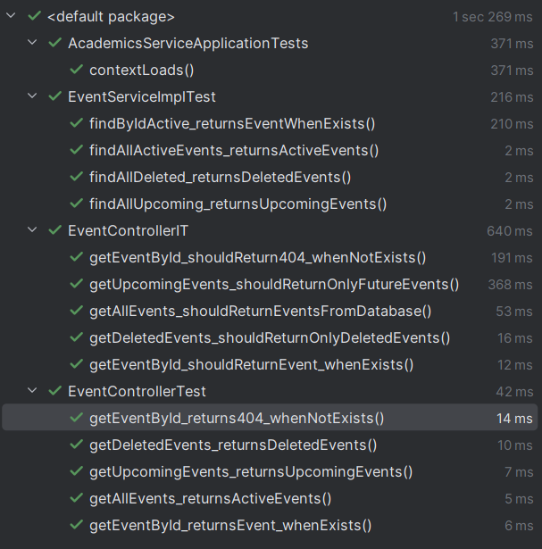

---

## **Установка и запуск**

### Развертывание

Инструкция по развертыванию:
1. Установить `Docker Desktop` (для Windows/Mac) или `Docker Engine + docker compose plugin` (для Linux). А также необходимо установить `Git`, если его еще нет.
2. Клонировать репозиторий с инфраструктурой. В командной строке прописать команды, представленные ниже.

```
git clone https://github.com/Karina2409/BRSM-Project.git
cd BRSM-Project
```

3. Переименовать `.env.example` в `.env`.
4. Изменить значения в `.env`. В поле `POSTGRES_USER` вписать `postgres`, а в поле `POSTGRES_PASSWORD` написать `p@sSw0rD`.
5. Запустить систему с помощью команды, представленной ниже.

```
docker compose up –d
```


### Манифесты для сборки docker образов

Представить весь код манифестов или ссылки на файлы с ними (при необходимости снабдить комментариями)

### Манифесты для развертывания k8s кластера

Представить весь код манифестов или ссылки на файлы с ними (при необходимости снабдить комментариями)

---

## **Лицензия**

Этот проект лицензирован по лицензии MIT - подробности представлены в файле [License.md](LICENSE.md)

---

## **Контакты**

Автор: kserduk54@gmail.com
