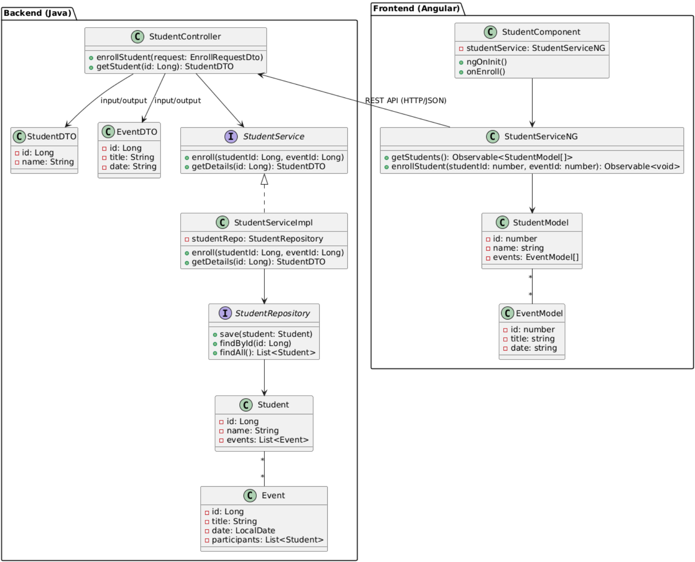

# **BRSM Project**

Краткое описание проекта, его цели и основные возможности

Ссылки на репозиторий сервера и клиента:

- [Репозиторий сервера](https://github.com/Karina2409/brsm-server)

- [Репозиторий клиента](https://github.com/Karina2409/brsm-frontend)

---

## **Содержание**

1. [Архитектура](#Архитектура)
    1. [C4-модель](#C4-модель)
    2. [Схема данных](#схема-данных)
2. [Функциональные возможности](#функциональные-возможности)
    1. [Диаграмма вариантов использования](#диаграмма-вариантов-использования)
    2. [User-flow диаграммы](#user-flow-диаграммы)
    3. [Примеры экранов UI](#примеры-экранов-ui)
3. [Детали реализации](#детали-реализации)
    1. [UML-диаграммы](#UML-диаграммы)
    2. [Спецификация API](#спецификация-api)
    3. [Безопасность](#Безопасность)
    4. [Оценка качества кода](#оценка-качества-кода)
4. [Тестирование](#Тестирование)
    1. [Unit-тесты](#Unit-тесты)
    2. [Интеграционные тесты](#интеграционные-тесты)
5. [Установка и запуск](#установка-и-запуск)
    1. [Манифесты для сборки docker образов](#манифесты-для-сборки-docker-образов)
    2. [Манифесты для развертывания k8s кластера](#манифесты-для-развертывания-k8s-кластера)
6. [Лицензия](#Лицензия)
7. [Контакты](#Контакты)

---
## **Архитектура**

### C4-модель

#### Контейнерный уровень архитектуры ПС

Программа будет содержать одну клиентскую часть и 5 микросервисов:
1. StudentService предназначен для обработки бизнес-логики, связанной со студентами. 
2. EventService будет обрабатывать бизнес-логику, связанную с мероприятиями. 
3. DataService будет обрабатывать бизнес-логику, связанную с импортом и экспортом данных в системе. 
4. SecurityService будет содержать логику авторизации, а также будет обрабатывать логику, связанную с данными пользователей. 
5. DocumentService будет обрабатывать бизнес-логику, связанную с освобождениями, ходатайствами и докладными. 

Также будет создано три базы данных: EventStudentDB, UserDB, DocumentDB. 

Для взаимодействия клиента с сервером будет создан специальный шлюз API Gateway. Он будет проксировать запрос к нужному сервису, а также будет проверять токен и безопасность.

#### Компонентный уровень архитектуры ПС

Компонентный уровень программного средства представлен на примере микросервиса StudentService. API Gateway будет отправлять запросы на определенные сервисы, которые в свою очередь будут отлавливать их в контроллерах и далее через сервисы и репозитории запросы будут идти в БД.

#### Диаграмма классов и интерфейсов

Клиентская часть будет отправлять запрос на сервер, далее StudentController использует дто StudentDTO и EventDTO. Запрос из контроллера будет идти в интерфейс StudentService. Далее обрабатывать этот запрос будет StudentServiceImpl – это реализация интерфейса StudentService. Он будет выполнять различные расчеты, и отправлять запрос в репозиторий, который в свою очередь отправит запрос в БД.

### Схема данных

#### База данных documents

#### База данных core_academics

#### База данных users_auth

---

## **Функциональные возможности**

### Диаграмма вариантов использования

Диаграмма вариантов использования и ее описание

### User-flow диаграммы

User-flow диаграмма для пользователя Студент

User-flow диаграмма для пользователя Секретарь БРСМ

User-Flow диаграмма пользователя Секретарь факультета

User-Flow диаграмма страницы Студенты

User-Flow диаграмма страницы Мероприятия

User-Flow диаграмма страницы Документация

User-Flow диаграмма страницы Статистика

User-Flow диаграмма страницы Профиль

User-Flow диаграмма страницы Пользователи

### Примеры экранов UI

#### Авторизация

#### Страница Студенты

#### Страница Информация о студенте

#### Страница Мероприятия

#### Страница Информация о мероприятии

#### Страница Изменение мероприятия

#### Страница Создание мероприятия

#### Модальное окно выбора студентов для мероприятия

#### Страница Освобождения

#### Страница Статистика

#### Страница Главная

#### Страница Профиль

---

## **Детали реализации**

### UML-диаграммы

Представить все UML-диаграммы , которые позволят более точно понять структуру и детали реализации ПС

### Спецификация API

Представить описание реализованных функциональных возможностей ПС с использованием Open API (можно представить либо полный файл спецификации, либо ссылку на него)

### Безопасность

Описать подходы, использованные для обеспечения безопасности, включая описание процессов аутентификации и авторизации с примерами кода из репозитория сервера

### Оценка качества кода

Используя показатели качества и метрики кода, оценить его качество

---

## **Тестирование**

### Unit-тесты

Представить код тестов для пяти методов и его пояснение

### Интеграционные тесты

Представить код тестов и его пояснение

---

## **Установка и запуск**

### Манифесты для сборки docker образов

Представить весь код манифестов или ссылки на файлы с ними (при необходимости снабдить комментариями)

### Манифесты для развертывания k8s кластера

Представить весь код манифестов или ссылки на файлы с ними (при необходимости снабдить комментариями)

---

## **Лицензия**

Этот проект лицензирован по лицензии MIT - подробности представлены в файле [License.md](LICENSE.md)

---

## **Контакты**

Автор: kserduk54@gmail.com
